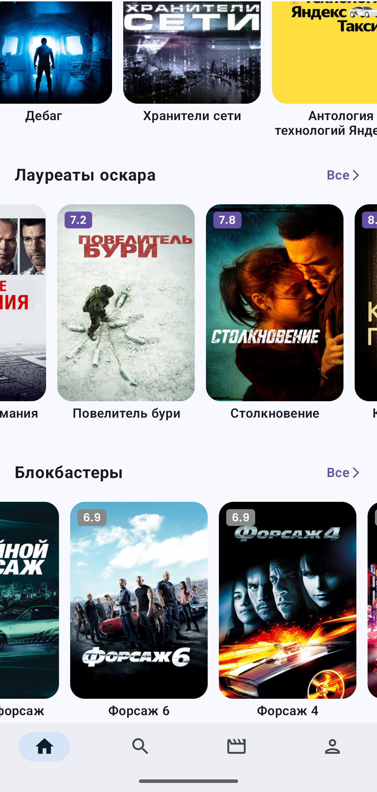
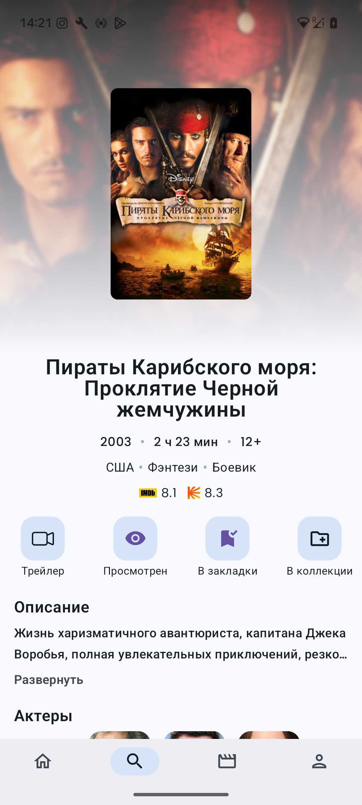

# Stary
Каталог всех фильмов и сериалов мира

## 🎬 Возможности приложения:

- Поиск фильмов и сериалов по жанрам, типу, рейтингу, году выпуска
- Подборка фильмов по коллекциям
- Возможность найти случайный фильм по заданным фильтрам
- Удобный и минималистичный интерфейс
- Быстрая загрузка и лёгкий доступ к информации

## 🔍 Гибкие фильтры
Выбирай, какие жанры тебе нравятся, задай диапазон рейтингов, нужный период — и получай только релевантные результаты.

## 🎲 Случайный выбор
Не знаешь, что посмотреть? Сервис сам подберёт фильм или сериал, основываясь на твоих предпочтениях.

## 📁 Коллекции и подборки
Лента с тематическими коллекциями поможет открыть новые фильмы — от классики до новинок.

## 📱 Простой и чистый интерфейс
Ничего лишнего — только то, что помогает быстро найти интересный контент.

## Стек
- Clean Architecture, MVI, Multimodule
- Kotlin, Coroutines, Flow
- Jetpack Compose, Navigation Compose
- Hilt (DI)
- Retrofit + OkHttp
- Room
- Baseline Profiles, R8 / ProGuard

## Скриншоты

  
  
  
  

## Скачать

